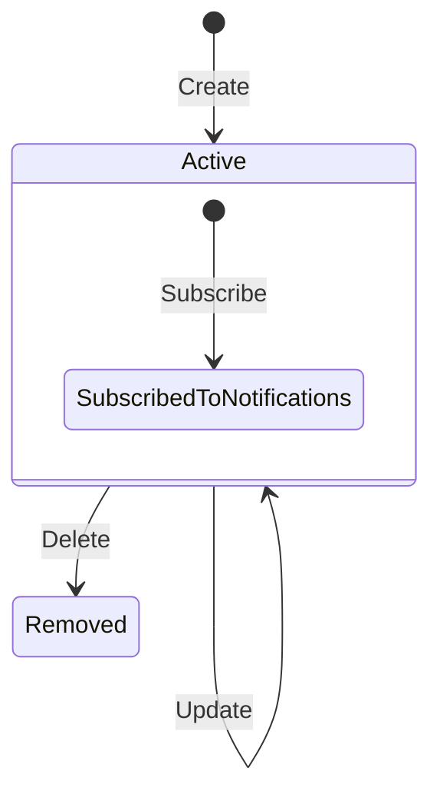
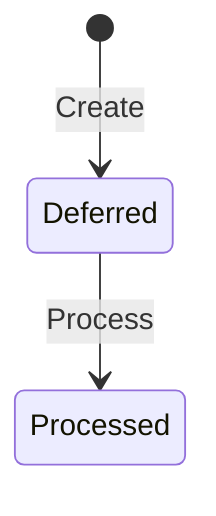
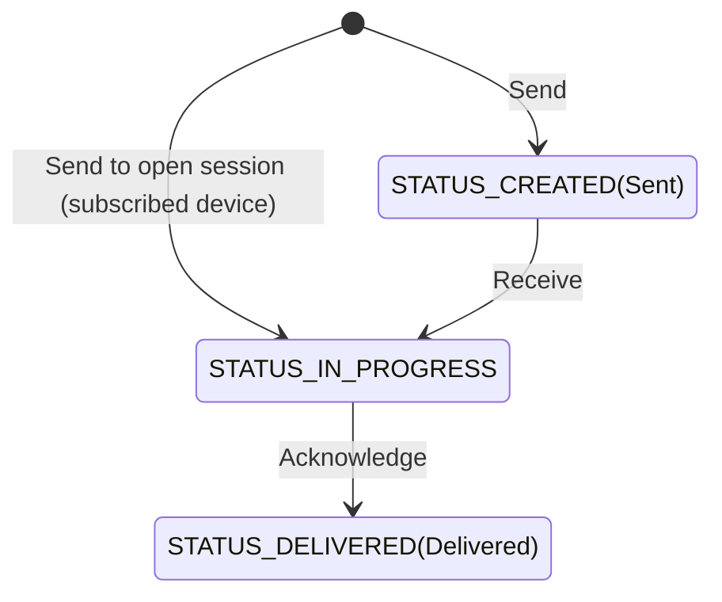

### Device

```mermaid
stateDiagram-v2
[*] --> Active: Create
state Active {
[*] --> SubscribedToNotifications: Subscribe
}
Active --> Removed: Delete
Active --> Active: Update
```

### Device Event

```mermaid
stateDiagram-v2 
[*] --> Deferred: Create
Deferred --> Processed: Process
```

### Notification

```mermaid
stateDiagram-v2 
[*] --> STATUS_CREATED(Sent): Send
[*] --> STATUS_IN_PROGRESS: Send to open session (subscribed device)
STATUS_CREATED(Sent) --> STATUS_IN_PROGRESS: Receive
STATUS_IN_PROGRESS --> STATUS_DELIVERED(Delivered): Acknowledge
```
