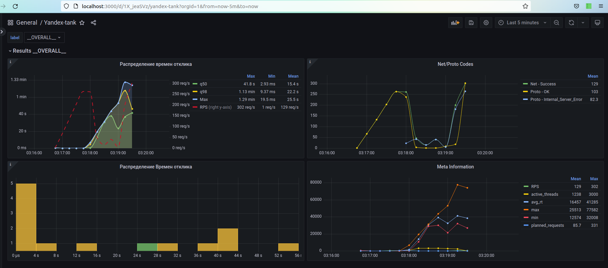

## Нагрузочный тест
### Условия
Запросы (файл `device-api-jsonline.ammo`):
```json lines
{"tag":"http_ListDevices", "uri": "/api/v1/devices?page=1&perPage=100", "method": "GET", "headers": {"Accept": "application/json"},"body": "", "host": "act-device-api"}
{"tag": "http_CreateDevice", "uri": "/api/v1/devices", "method": "POST", "headers": {"Accept": "application/json", "Content-Type": "application/json", "Content-Length": "36"}, "body": "{\"platform\": \"ios\",  \"userId\": \"222\"}", "host": "act-device-api"}
{"tag":"http_DescribeDevice", "uri": "/api/v1/devices/8", "method": "GET", "headers": {"Accept": "application/json"},"body": "", "host": "act-device-api"}
{"tag": "http_UpdateDevice", "uri": "/api/v1/devices/8", "method": "PUT", "headers": {"Accept": "application/json", "Content-Type": "application/json", "Content-Length": "37"}, "body": "{\"platform\": \"andr\",  \"userId\": \"333\"}", "host": "act-device-api"}
```
### Ресурсы
Для act-device-api выставлены следующие ограничения по ресурсам:
```yaml
services:
#<...>
  act-device-api:
  #<...>
    deploy:
      resources:
        limits:
          cpus: '0.5'
          memory: 256M
        reservations:
          memory: 128M
```

### Нагрузка
В файле `load.yaml`:
```yaml
pandora:
#  <...>
        rps:
          duration: 1m30s
          from: 1
          to: 400
          type: line
        startup:
          type: once
          times: 3000
```
### Результаты
Точка насыщения в районе 250-300 RPS



Примерно на 260 RPS:
- появляются и начинают расти 500-ые ошибки
- увеличивается время отклика
- растет до заданного максимума количество активных запросов (горутин)

P.S. При этом почему-то при тесте через gRPC точка насыщения достигается при меньшем кол-ве RPS
